# Abdelhalim Kouraba

### Software & Web Developer

Building modern digital experiences with a focus on clean development, polished interfaces and responsive web applications.

  

---

## ⚡ About Me

I'm a software and web developer with a focus on creating modern websites and web applications.

I enjoy combining development and design to build interfaces that feel polished, responsive and easy to use.

---

## 🧩 Technologies

### Frontend

  

### Backend & Data

  

### Tools

  

---

## 📊 GitHub Activity

  
  

  

---

## 🐍 Contribution Snake

  

---

## 🌐 Find Me

  
  

---

### Thanks for stopping by 👋

